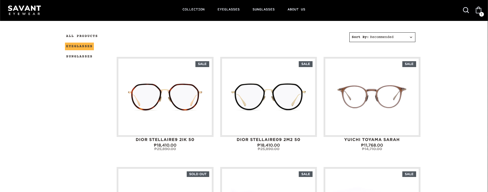

# Sprint 16

## Topics
### React Testing
- [Intro to React testing](https://www.theodinproject.com/lessons/node-path-react-new-introduction-to-react-testing)
    - [Vitest](https://vitest.dev/)
    - [RTL](https://testing-library.com/docs/react-testing-library/intro/)
    - [StoryBook](https://storybook.js.org/docs/get-started/why-storybook)
- [Mocking Callbacks and Components](https://www.theodinproject.com/lessons/node-path-react-new-mocking-callbacks-and-components)

### [Styling in react](https://www.theodinproject.com/lessons/node-path-react-new-styling-react-applications)
- CSS Modules
- CSS utility Frameworks
- CSS in JS
- Component Libraries

### Client Side Routing
- [React Router](https://www.theodinproject.com/lessons/node-path-react-new-react-router)

### [Fetching data](https://www.theodinproject.com/lessons/node-path-react-new-fetching-data-in-react#using-custom-hooks)
- Fetch
- Axios
- React Query

### Hosting
- [Vite - Deploying a static site](https://vitejs.dev/guide/static-deploy)

## Assignment
- Setup AWS
  Setup [AWS Account](https://aws.amazon.com/free/?gclid=CjwKCAiAkp6tBhB5EiwANTCx1Lt_JjBb-bKmHnFsd3NuTEgqwaDb_VKtyqArE16B53nf3Dw5FTQHyxoCqPQQAvD_BwE&trk=7541ebd3-552d-4f98-9357-b542436aa66c&sc_channel=ps&ef_id=CjwKCAiAkp6tBhB5EiwANTCx1Lt_JjBb-bKmHnFsd3NuTEgqwaDb_VKtyqArE16B53nf3Dw5FTQHyxoCqPQQAvD_BwE:G:s&s_kwcid=AL!4422!3!651751058808!e!!g!!aws%20registration!19852662149!145019244377&all-free-tier.sort-by=item.additionalFields.SortRank&all-free-tier.sort-order=asc&awsf.Free%20Tier%20Types=*all&awsf.Free%20Tier%20Categories=*all) & [AWS CLI](https://docs.aws.amazon.com/cli/latest/userguide/getting-started-install.html) (Will need to setup an [IAM role to get tokens](https://docs.aws.amazon.com/IAM/latest/UserGuide/getting-set-up.html#create-an-admin))

## Project - [Shopping Cart](https://www.theodinproject.com/lessons/node-path-react-new-shopping-cart)

Make your own e-commerce website with a cart and deploy it. Bonus: Use Typescript

## Thursday
1. React testing -> implement on Flashcards repo
2. Styling ->
   1. Demo all options listed above
   2. Pick one as a team and implement
3. React router - intro & if time implement 